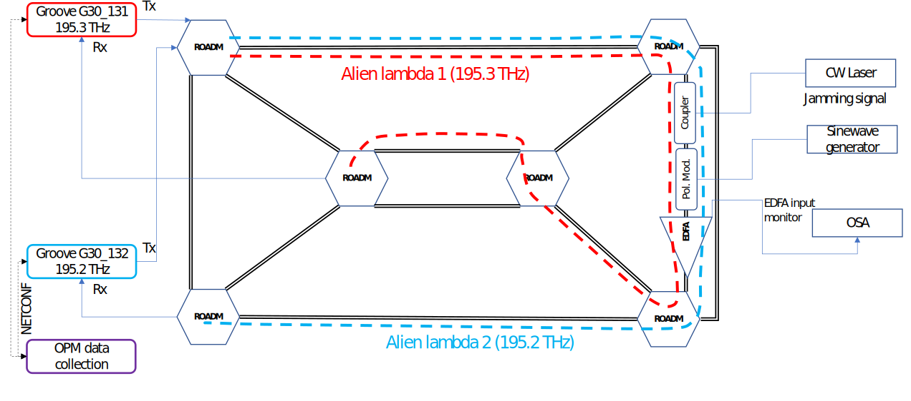

# Machine Learning for Optical Network Security Monitoring: A Practical Perspective

Authors: [Marija Furdek](https://www.chalmers.se/en/staff/Pages/Marija-Furdek-Prekratic.aspx)\*, [Carlos Natalino](https://www.chalmers.se/en/staff/Pages/Carlos-Natalino-Da-Silva.aspx)\*, Fabian Lipp\*\*, David Hock\*\* Andrea Di Giglio\*\*\*, and Marco Schiano\*\*\*

\* Department of Electrical Engineering, Chalmers University of Technology, Gothenburg, Sweden (e-mail: furdek@chalmers.se, carlos.natalino@chalmers.se).

\*\* Infosim GmbH & Co. KG, Wu ̈rzburg, Germany (e-mail: lipp@infosim.net, hock@infosim.net).

\*\*\* Telecom Italia, Turin, Italy (e-mail: andrea.digiglio@telecomitalia.it, marco.schiano@telecomitalia.it).

Accepted for publication in JLT.

**Abstract:** In order to accomplish cost-efficient management of complex optical communication networks, operators are seeking automation of network diagnosis and management by means of Machine Learning (ML). To support these objectives, new functions are needed to enable cognitive, autonomous management of optical network security. This paper focuses on the challenges related to the performance of ML-based approaches for detection and localization of optical-layer attacks, and to their integration with standard Network Management Systems (NMSs).
We propose a framework for cognitive security diagnostics that comprises an attack detection module with Supervised Learning (SL), Semi-Supervised Learning (SSL) and Unsupervised Learning (UL) approaches, and an attack localization module that deduces the location of a harmful connection and/or a breached link. The influence of false positives and false neg- atives is addressed by a newly proposed Window-based Attack Detection (WAD) approach. We provide practical implementation guidelines for the integration of the framework into the NMS and evaluate its performance in an experimental network testbed subjected to attacks, resulting with the largest optical-layer security experimental dataset reported to date.

Paper available at IEEE Xplore (to be published).

## What is in this repository?

The paper reports only the best configurations of the machine learning models. In this repository, however, we present the entire set of experiments performed to find the best configuration for each model.

With respect to the dataset, we evaluated three different approaches. The dataset is not included in this repository due to confidentiality agreement. The three approaches are:
- **FD**: Using the full dataset (dataset including lightpaths 1 and 2) to train a single ML model without specifying which samples comes from which path (we do not have one-hot information for the path).
- **P1** and **P2**: Training the ML models for a single path (two models, one for each path).
- **OH**: Using the full dataset to train a single model, specifying the lightpath which a sample comes from (including two one-hot columns for the path identification).
The results showed that the **FD** approach achieves the best trade-off between complexity and accuracy, and was therefore used for the results in the paper.

We are releasing the following codes:

- The implementation of the supervised learning (artificial neural network)
- The implementation of the semi-supervised learning (one-class support vector machine)
- The implementation of the unsupervised learning (DBSCAN)
- Result analysis and plotting

## Setting up your environment (which libraries are required?)

The implementation uses tensorflow 2.x, pandas, scikit-learn and matplotlib.

In the command line, at the folder containing this repository, you can run:

**If you are running Anaconda:**

`conda create --name <env_name> python=3.7 --file requirements.txt`.

**If you are running pip:**

`pip install --user --requirement requirements.txt`.

### Citing the work

Bibtex entry:

~~~~
TO BE DEFINED
~~~~
